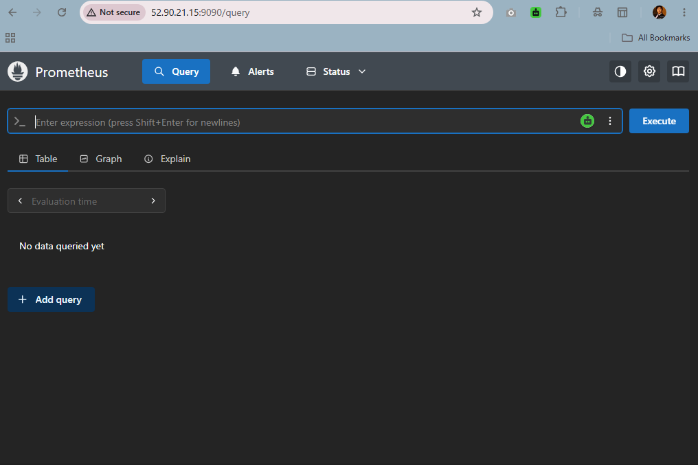
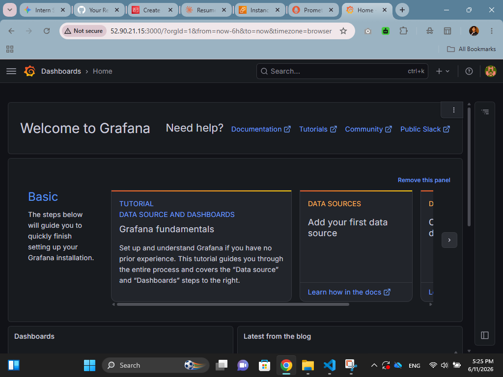

# Cloud-Native Infrastructure Monitoring Stack with Prometheus & Grafana

This repository demonstrates the automated deployment of a production-ready monitoring stack on AWS using Terraform and Docker. It upgrades traditional infrastructure monitoring workflows into a modern, cloud-native observability solution.

## 🏗️ Architecture & Component Breakdown
* **Infrastructure Provisioning:** Terraform handles the automated provisioning of the AWS EC2 compute node and state definitions.
* **Firewall Configuration (Security Groups):** Custom ingress rules map and expose standard visualization ports safely (`9090` for Prometheus, `3000` for Grafana).
* **Containerized Deployment:** Utilizing EC2 `user_data` scripts, Docker is dynamically installed upon system boot to instantly spin up isolated Prometheus and Grafana containers.

## 🛠️ Tech Stack
* **Infrastructure as Code:** Terraform
* **Containerization:** Docker
* **Metrics Collector:** Prometheus
* **Visualization Dashboard:** Grafana
* **Cloud Platform:** Amazon Web Services (AWS)

## 📸 Monitoring & Verification Evidence

### 1. Prometheus Time-Series Database UI
Verification that the Prometheus server is active and polling runtime metrics over port 9090:

### 2. Grafana Observability Dashboard
The multi-platform data analytics platform rendering metrics and allowing secure administrative login over port 3000:

